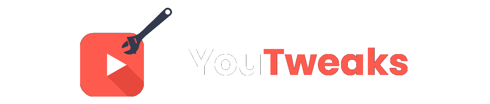

  

## Install

**Chrome / Edge / Brave:**
1. Download [`youtweaks-v1.0.zip`](https://github.com/KanAvR/YouTweaks/releases/download/v1.0/youtweaks-v1.0.zip) from the latest release.
2. Unzip the file.
3. Go to `chrome://extensions` → enable **Developer mode** → click **Load unpacked** → select the unzipped folder.

**Firefox:**
[Add to Firefox](https://addons.mozilla.org/en-US/firefox/addon/youtweaks/)

Extension isnt approved yet so the link wont work.

To sideload:
1. Download and unzip the release zip.
2. Go to `about:debugging#/runtime/this-firefox` → **Load Temporary Add-on…** → select `manifest.json`.

## Features

### Removals

| Feature | Description |
|---------|-------------|
| Blur Thumbnails | Blurs all video thumbnails to reduce clickbait temptation |
| Hide Create Button | Removes the "Create" button from the top bar |
| Hide Notifications Button | Removes the notifications bell from the top bar |
| Hide Mic Button | Removes the voice search microphone button |
| Stop Thumbnail Hover Effects | Prevents auto-playing video previews on hover |
| Hide Recommendation Bar | Removes the category filter chips from the homepage |
| Hide Gemini/AI Features | Removes AI-generated summaries and "Ask" buttons |
| Hide Progress Bars | Removes watched progress indicators on thumbnails |
| Hide Shorts | Removes all Shorts content from feeds and sidebar |
| Hide YouTube Games | Removes the Games section from sidebar and homepage |
| Hide Merch Store | Removes merch and shopping shelves |

### Additions

| Feature | Description |
|---------|-------------|
| Move Views & Date to Top Row | Shows view count and upload date as badges next to the like button |
| Custom Color Theme | Change YouTube colors |
| Custom Playback Speed | Adds a speed button allowing speeds from 0.25x to 5x without requiring Premium |

Enable **Custom playback speed** in the popup's **Additions** tab. Click the speed button in the player controls or **Settings → Playback speed** to open the custom controls. YouTweaks applies your choice directly to the video and keeps it selected if YouTube resets it. Use the **1.0** preset for normal playback. The panel includes minus/plus buttons, a slider, and an editable speed readout. Turning the toggle off removes the custom controls and restores YouTube's menu. The settings-menu replacement currently recognizes the English “Playback speed” label; the separate button works in every language.

### Time Tracking

| Feature | Description |
|---------|-------------|
| Daily Watch Time Badge | Displays total time spent on YouTube today |
| Daily Time Limit | Sets a maximum daily YouTube usage |
| Bedtime Cutoff | Blocks YouTube during configured hours |

## Permissions

- `storage` to save user preferences and watch time data
- `scripting` to inject content scripts on YouTube pages

## Acknowledgements
- [Rosé Pine](https://rosepinetheme.com/palette/)
- [Catppuccin](https://catppuccin.com/palette/)
